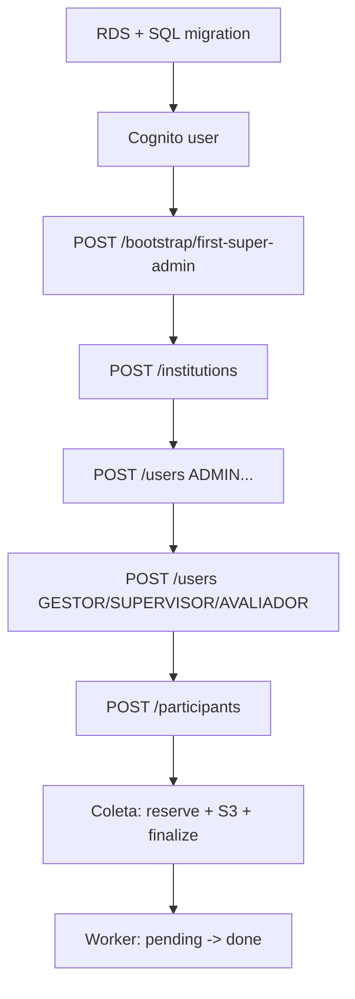

# Bootstrap do sistema zerado (RDS + Cognito + S3)

Sem migração de dados do Supabase. Ordem segura alinhada a `docs/db-bootstrap-plan.md` e `API/app60-api/src/routes/bootstrap.ts`.

## 1. Infraestrutura (conta Staging ou Production)

1. RDS PostgreSQL vazio.
2. Aplicar `API/app60-api/src/db/migrations/001_initial_aws_schema.sql`.
3. Cognito User Pool + App client (SPA / app) na mesma conta.
4. Bucket S3 para raw + IAM da API (presign PUT) e do worker (GetObject).
5. Definir variáveis: ver `.env.staging.example` / `docs/deployment-envs.md`.

## 2. Auth zerado

1. Criar **manualmente** no Cognito o primeiro utilizador humano (ou via consola / CLI).
2. Anotar o **sub** Cognito (`cognitoSub`) e o e-mail.

## 3. Primeiro SUPER_ADMIN (banco zerado)

1. Definir `BOOTSTRAP_SECRET` na API (só para este momento).
2. `POST /bootstrap/first-super-admin` com header `x-app60-bootstrap-secret: <segredo>` e JSON:

```json
{
  "cognitoSub": "<sub do Cognito>",
  "email": "admin@example.com",
  "fullName": "Nome Completo"
}
```

3. Resposta **201** cria linha em `app_users` com `role = SUPER_ADMIN` e `primary_institution_id = NULL`.
4. Se `app_users` já tiver linhas, resposta **409** — bootstrap bloqueado.
5. **Rotacionar ou remover** `BOOTSTRAP_SECRET` após uso.

## 4. Institutions

1. Login na web como SUPER_ADMIN (Cognito + chamada `/api/me`).
2. `POST /api/institutions` com `{ "name": "...", "slug": "..." }` opcional.

## 5. Admins

1. SUPER_ADMIN: `POST /api/users` com `role: "ADMIN"`, `institutionId` da instituição criada, credenciais Cognito criadas pela API (fluxo atual em `users.ts`).

## 6. Gestores, supervisores, avaliadores

1. **ADMIN** (ou SUPER_ADMIN com `institutionId`): `POST /api/users` com `role` ∈ `GESTOR` | `SUPERVISOR` | `AVALIADOR`.
2. Para **AVALIADOR**, opcional `supervisorId` (deve ser SUPERVISOR ativo na mesma instituição).

## 7. Participantes globais e vínculo

1. Utilizador com instituição (não SUPER_ADMIN no fluxo atual): `POST /api/participants` cria/atualiza `participants` por CPF e garante linha em `participant_institution_history` com `reason = 'ENROLL'` se não houver vínculo aberto.

## 8. Storage zerado

- Bucket vazio no primeiro deploy.
- Primeiro upload: app chama `POST /api/collections/reserve` → PUT S3 → `POST /api/collections/:id/finalize-upload`.

## 9. Worker (ex.: Render)

- Serviço separado com `DATABASE_URL`, `AWS_REGION` e credenciais AWS (env ou OIDC).
- **Não** usa Supabase; consome fila `collections.processing_status = 'pending'` (`Worker/worker.py`).

## Diagrama lógico (ordem)


